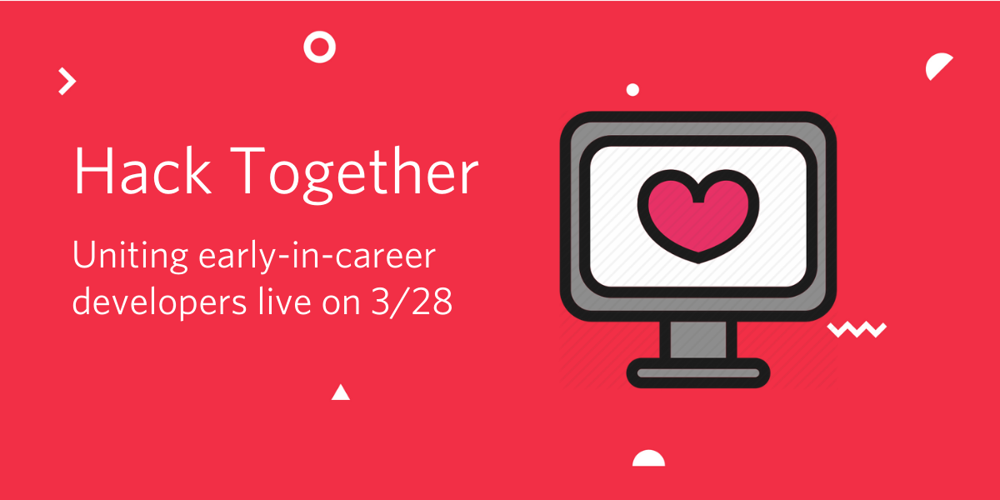
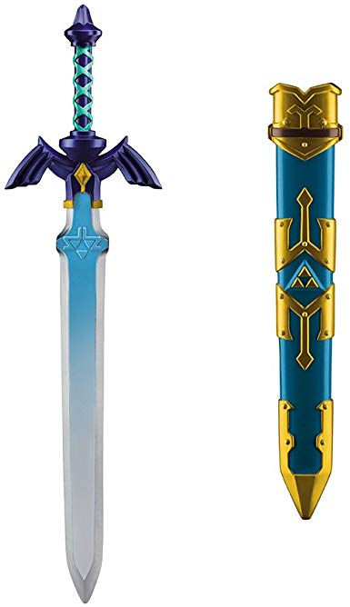
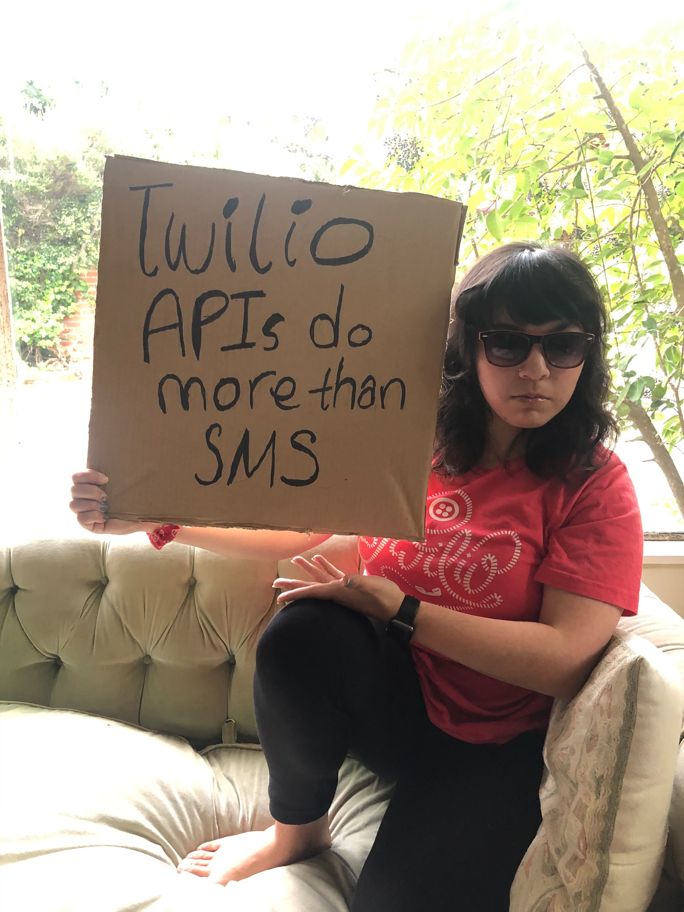

## Hack Together

Goal: to connect, support, educate, entertain, and empower the hacker community during a trying time when many have been displaced from their campuses.

Submit a PR with a question you'd like to ask the Father of Python Guido van Rossum then tune in 3/28 at 4pm to see if it's answered on [Twilio TV](https://twitch.tv/twilio). We'll have other activities, talks, games, and [contests](#asynchronous-contests) throughout the weekend of [LA Hacks](https://lahacks.com/), [RowdyHacks](https://www.rowdyhacks.io/), and [HooHacks](https://www.hoohacks.io/) to keep you entertained and learning.

|                                            | Time            | Talk                                                                                     | Speakers                                                                                 |
|--------------------------------------------|-----------------|------------------------------------------------------------------------------------------|-----------------------------------------------------------------------------------------|
 |                                                                                         |
| Saturday 3/28                              |  (all PST)               |                                                                                         |
|  [TwilioQuest  Tea Time LAHacks workshop](https://lahacks.com/link/twilio)                  | 9am-9:30am | Learn Twilio products and general programming skills with a video game, [TwilioQuest](twilio.com/quest). Win Zelda swords and more!              | Twilio Developer Evangelists Gary Hockin, Lizzie Siegle, Cedric                                                      |
|                                    |                                         |                                                                                         |
| Morning Kickoff                            | 9:30am-10:15am        | Welcome, intro to schedule, contests, where to tune in and learn more, etc.       | Lizzie                                                                           |
| Morning stretch                            | 10:15am-10:30am    | Take a stretching and yoga break!                                    |                                                                                         |
| Intro to Security                          | 10:30am-11am    | Get a deep-dive into security                                                       | [HackathonMentors](hackathonmentors.org) founder and MLH Coach [Kyle Suero](https://kylesuero.com/)                                                              |
| Setup a Web Page with GH Pages             | 11am-11:30am    | Get a personal webpage setup with GitHub Pages.                                           | Microsoft Dev PMM [Kim Noel](https://twitter.com/NoelKM)                                                              |
| Crafts and Chit-chat                       | 11:30am-12pm    | Learn origami and draw-the-owl contest.                                                    |                                                                                         |
| Engineer resume reviews                    | 1pm-1:30pm      | Still on that job hunt? Optimize your resume with a review.                                                                 | Twilio engineer [Duy Nguyen](https://www.linkedin.com/in/aiden-nguyen/)                                                              |
| Get Creative with Code                     | 1:30pm-2pm      | Make music with [Sonic Pi](http://sonic-pi.net/), a free code-based music creation and performance tool, and maybe with a npm module as well, time-permitting.                                                |       Engineer [Amy Dickens](https://twitter.com/redroxprojects)                                                                                  |
| The transition from college to industry    | 2pm-2:30pm      | Learn how to make the transition to full-time.                                            | Newsela engineer [Prince Wilson](https://twitter.com/maxcell)                                                          |
| Dev Trivia contest with prizes                         | 2:30pm-3pm      | Get your trivia on.                                                                              |                                                                                         |
| Mock interviews breakout                   | 3pm-3:45pm      | LinkedIn optimization and interview prep.                                                 | Twilio recruiters and engineer [Bex Warner](https://twitter.com/hiimbexo)                                               |
| Q&A with Father of Python Guido van Rossum | 4pm-5pm         | You won't want to miss this. | Guido van Rossum                                                                        |
| Design Thinking for Engineers              | 5pm-5:45pm      | Learn design hacks, tips, and tools for engineers.                                        | Twilio Principal Product Designer for AI [Elaine Lee](https://medium.com/@elainelee)                                            |
| How to craft a winning hackathon pitch     | 7pm             | Are you ready to demo tomorrow? Tune in to find out how best to pitch and demo your hack. | Girls Make Apps founder, TechCrunch Disrupt winner, and Stanford student [Akshaya Dinesh](http://akshayadinesh.me/) |
| Games            | 7:30pm          | Jackbox, Dev Charades, and more!                                                                                    |                                                                                         |
| Intro to Machine Learning                  | 8pm             | Get started with Machine Learning                                                                        | AWS evangelist [Nick Walsh](https://twitter.com/TheNickWalsh)                                                               |
| LeetCode Live                           | 9pm             | See engineers answer LeetCode in real-time!                                              | former SB Hacks organizer [Diane Phan](https://dianephan.github.io/) and Airtable engineer [Tim Deng](https://timdeng2324.github.io/)                     |
| Dev Charades                               | 10pm            | Dev-themed charades.                                                                                                    |                                                                                         |
| Dev Show-and-Tell                          | 10:30pm         | Show off what you're working on!                                                                                       |                                                                                         |
| TwilioQuest-playing                        | 11pm            |It's a training tool. It's a  video game. It's [TwilioQuest](twilio.com/quest)!  You can still earn XP and swag to win a Zelda sword IRL (we will mail it to you).                                                                                                                        |                                                                                         |
| Devtime/Bedtime Story                      | 11:30pm         | Bed time? More like dev time, amirite? Hear a new version of an old favorite                                           |                                                                                         |
|                                            |                 |                                                                                                                        |                                                                                         |

### Asynchronous Contests
In addition to sponsoring best use of the Twilio API for LA Hacks (which is open to people who did not register as well) and Rowdy Hacks and some contests during the livestream above, we also have
- Play [TwilioQuest](twilio.com/quest) this weekend, earning XP and swag by completing missions for the chance to win an IRL Zelda sword.
- <em>#devWithSign</em> contest. Take a picture of yourself AT HOME with a homemade sign similar to [Dude with Sign](https://www.forbes.com/sites/heatherleighton/2020/01/28/meet-the-creators-of-the-dude-with-sign-instagram-account/#460ad5b01d7d). Post it publicly on Twitter or Linkedin with the hashtags #devsign and #hacktogether and tag @twilio as well.

  
   

